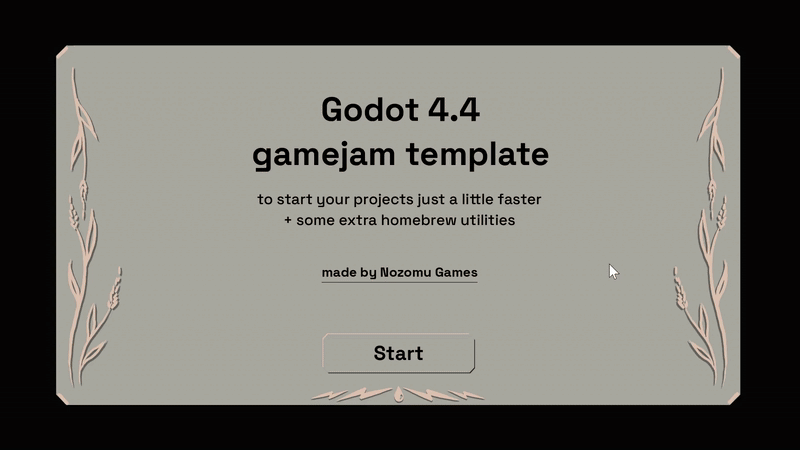

# This is a Godot 4.4 template for gamejams and small games.
Made by Ivan Bushmin from [Nozomu Games](https://nozomugames.com/)
  
### For gamejam lovers, this will help save those sweet first hours and let you make the game, skipping the shell.
 

### For Godot newcomers, I hope this can also act as a glimpse into how things can be done - not a strictly "correct" way of doing things, just one of possibilities.

  

  
# What's inside

- 3 main screens: title screen, game and end screen
- additional views (pause screen, UI)
- clean folder structure
- music/sfx volume sliders 
- a couple of homebrew utilities like AudioManager and TransitionManager
- an example character with some animations, movement and even barking - mainly to showcase some code structure/architecture patterns I use
- a couple of secrets hidden in code - feel free to find and use them!

**This template should give you that basic "shell" for a game, saving an hour or two during setup, while not restricting with the direction of the game itself. Create stuff!**